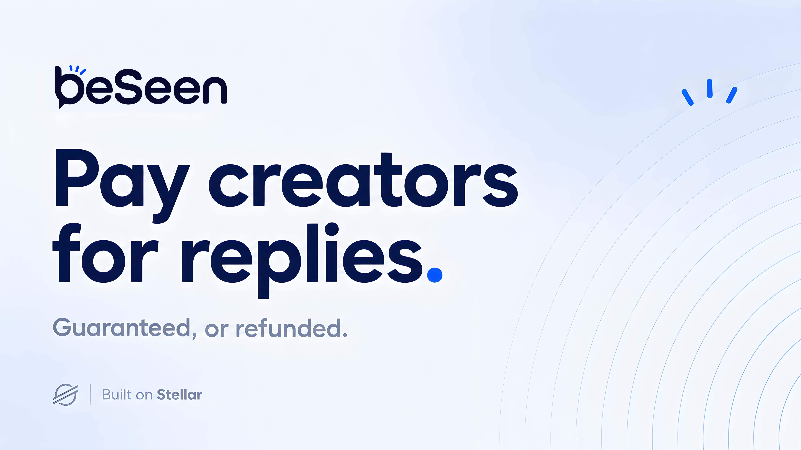

  

<h1 align="center">BeSeen</h1>

  <strong>Pay creators for replies. Guaranteed, or refunded.</strong>

  A messaging marketplace for reaching creators, experts, and public figures.

  <a href="https://beseen.fi">Website</a>
  ·
  <a href="https://x.com/beseenfi">X</a>

---

## What is BeSeen?

BeSeen turns attention into a clear outcome.

Send a direct message with a bounty and set a deadline. The bounty is secured by a **Soroban smart contract** until the recipient responds.

- **Reply before the deadline** → the recipient receives the bounty.
- **No reply** → the sender gets a full refund.

No paying for silence. No obligation to respond.

## Auras

Every creator has an **Aura** — an access pass that unlocks direct messaging and private broadcasts.

Auras create a permission layer around a creator's inbox, while bounties give senders a way to signal how valuable a response is to them.

## Built on Stellar

BeSeen uses **Stellar** and **Soroban smart contracts** to enforce the core payment flow:

- Bounty escrow
- Reply deadlines
- Payouts
- Automatic refunds

The rules are enforced by the contract, not by BeSeen.

---

  <strong>Pay for the reply, not the possibility.</strong>

  <a href="https://beseen.fi"><strong>beseen.fi</strong></a>

